<h1 id="c1">A Testbed Environment for Task Development </h1>
<h2 id="introduction">Introduction</h2>

According to , swarm robotics is an approach to collective robotics that takes inspiration from the self-organized behaviors of social animals. Through simple rules and local interactions, swarm robotics aims for robust, scalable and flexible collective behaviors for the coordination of large numbers of robots. In contrast, the term swarm engineering  describes the design of predictable, controllable robot swarms with well-defined goals and the ability to function under certain conditions. Swarm engineering focuses mainly on concepts that could be relevant for real-world applications, therefore shifting swarm robotics to engineering applications. We motivate a smarter ecosystem for task development upon drones by beginning with the infrastructure for new technologies and for prototyping functionalities. A centralised swarm framework serves to set up flight performance monitoring systems, a fundamental asset to the development of robots and multi-robot groups .

Multi-robot systems and swarms of unmanned aerial vehicles (UAVs) in particular have many practical applications.  from March 2021 shows applications as diverse as surveillance and monitoring, inventory management, search and rescue, or in the entertainment industry. Swarm intelligence has, by definition, a distributed nature. Yet performing experiments in truly distributed systems is not always possible, as much of the underlying ecosystem employed requires some sort of central control. Indeed, in experimental proofs of concept, most research relies on more traditional connectivity solutions and centralized approaches .

In recent years there have been significant advancements in this research field. However, very rarely do UAV swarms leave the controlled and safe environment of laboratories, and when they do it is for short-duration experiments. The current use of swarms is generally based on custom, centralized solutions, in environments with reliable communication . There remains large challenges to reliable flight of UAVs: the reliability of software, the limits on the hardware, test and validation of new elements on pre-existing systems . A further challenge concerns multi-robot functionality. Current UAVs have very limited functionality for multi-robot coordination. Market drones are too limited for swarm research, as they only supports a single point-to-point link between a program and the drone, thus, a program can only communicate with a single drone.

In line with the thesis goal, we seek to better understand how distributed systems can offer smart assistance to multi-robot development. We explore research and techniques designed to coordinate multiple robots.

<h2 id="related-work">Related Work</h2>

In this section, we examine how researchers tackle the challenge of swarm engineering in the past. Prior work exists in a variety of drone laboratories  . Drones Spatial Localization, UAV Architectures and UAV Swarm Frameworks require tradeoffs.

<h3 id="uav-spatial-localization">UAV Spatial Localization</h3>

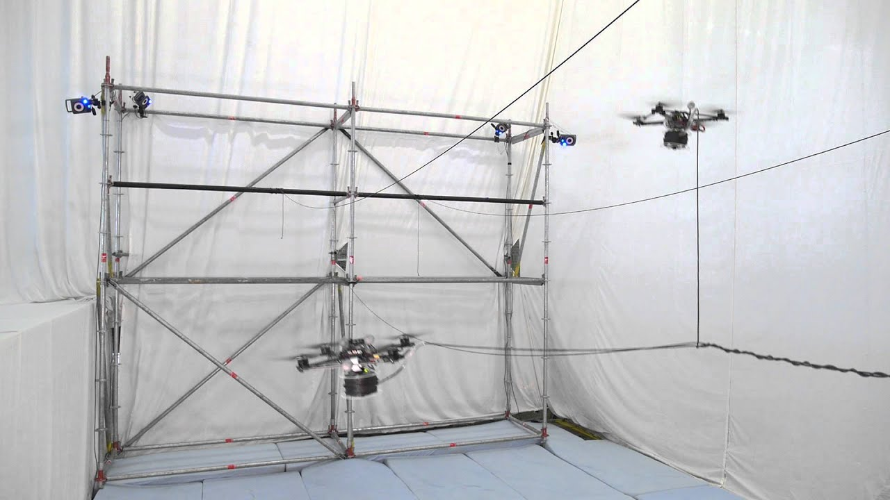<figcaption>An example of drones tracked by two motion capture cameras.  </figcaption>

The Flight of UAVs, as with any robotic system, requires accurate positioning. However, a drone suffers from cumulative drift in position data . In order to achieve autonomous flight, a drone will need to know if it is following a trajectory correctly. A localization technology allows for this centimeter level accuracy.

It is by using highly precise equipment, that UAVs can have highly precise state estimation. This setup includes the selection of onboard positioning systems as well as external positioning solutions. We focus on optical motion capture coupled with algorithms for state estimation primarily a set of technologies commonly used by UAV laboratories  :.

The high level of precision from a motion capture system allows us to synchronously hover multiple UAVs. The tracker precision can reach sub-millimeter accuracy, and drones are hovered at a precision of a few centimeters.

<h3 id="uav-architectures">UAV Architectures</h3>

UAVs such as AscTec Pelican, Parrot AR.Drone, and Erle-Copter are other examples of UAVs commonly used in the literature. These MAVs have Software Development Kits (SDK) that enable applications from third-party developers to communicate with the drones. However, both SDKs are too limited for swarm research, as they only supports a single point-to-point link between a program and the drone, thus, a program can only communicate with a single drone.

<figcaption>The Crazyflie 2.1 miniature quadcopter.  </figcaption>

In comparison, the Crazyflie packages the full robotic stack. This robotic stack includes its own state estimator, control architecture and trajectory follower, which work out of the box. FreeRTOS handles the scheduling of processes and control the flight calculations. The Crazyflie contains a 32-bit, 168MHz ARM microcontroller with floating-point unit that is capable of significant onboard computation. The FreeRTOS firmware is opensource and modifiable.

The Crazyflie’s small size makes it suitable for indoor flight in dense formations. As a result, it has been used widely in research. As of 2021, this drone is used to validate research: from new algorithms for agile flight  to drone swarm research .

<h3 id="uav-swarm-frameworks">UAV Swarm Frameworks</h3>

Unmanned Aerial Vehicle (UAV) swarms have been used indoors for formation flight and collaborative behaviors, outdoors to demonstrate swarming algorithms, and in the media for artistic shows. According to <em></em> , The group of robots has some special characteristics, which are found in swarms of insects, that is, decentralised control, lack of synchronisation, simple and (quasi) identical members. In this section, we explore the requirements placed on the software framework for interacting with a robot swarm.

 <em></em> discuss the key requirements a successful programming language for swarm robotics must meet. According to them, the level of abstraction need be adapted to the task at hand. The complexity of concentrating on individual robots and their interactions, i.e., a bottom-up approach, increases steeply with the size of the swarm. Conversely, a purely top-down approach, i.e., focused on the behaviour of the swarm as a whole, might lack expressive power to fine-tune specific robot behaviors. The runtime platform of the language must ensure acceptable levels of <strong>scalability</strong> (for increasing swarm sizes) and <strong>robustness</strong> (in case of temporary communication issues).

 <em></em> present The Flying Machine Arena. This was put in place in 2014 with the goal of becoming a "demo-and-development" arena. They include both single and multi-robot experiments. One key element of their work is that the UAV swarm can be heterogeneous. Additionally, the position controller runs offboard, that is, the UAVs all rely on a companion computer to position themselves. The additional computational power is used for a latency compensation algorithm to improve accuracy for high-speed flights. Despite this, the framework remains robust: swarms of up to 5 UAVs are flown on a regular basis.

 <em></em> define a system architecture for a large swarm of miniature quadcopters flying in dense formation indoors. The main challenges in swarm robotics are addressed in this framework, namely by reducing communication latency to 26ms. This is done in major part via the structure of messages broadcasted to the UAV. Preiss et al.  use a programmable UAV with an onboard position controller, making the system more robust to communication packet drops. With this method, a swarm of 49 Crazyflies have been flown using 3 radios. As a result, the drone swarm framework allows for robotics developers to send commands to drones in a fleet. A scalable and robust run-time platform is, in this way, a key element for real-world deployment of swarm behaviors.

<h3 id="uav-software-and-middleware">UAV Software and Middleware</h3>

UAVs have a long tradition of being controlled with the Robotic Operating System. ROS is a meta-operating system designed for the construction of distributed systems. It provides a set of extensible tools for managing distributed robotic applications. The main goals of ROS are package management, hardware abstraction, low-level device control, message exchange between processes, and implementation of several functionalities. As a result, there are many ROS packages devoted to controlling such UAVs as individuals.

However, using multiple UAVs creates entirely new challenges that such packages cannot address. These new challenges include, but are not limited to, the physical space required to operate the robots, the interference of sensors and network communication, and safety requirements. In  and , thus motivates the use of a hardware abstraction layer on top of the Crazyflie. This abstraction layer, in the form of a ROS layer, is only used on the PC controlling one or more Crazyflies. The ROS driver sends the data to the different quadcopters using the protocol defined in the Crazyflie firmware.

 <em></em> demonstrates interoperability between the PC and UAV components. The <em>crazyflie_ros</em> framework helps wrap CRTP within a ROS framework, which is useful for scenarios of hovering and waypoint following from a single robot to the more complex multi-UAV case. It provides not only standard operating system services (hardware abstraction, contention management, process management), but also high-level functionalities (asynchronous and synchronous calls, centralised database, a robot configuration system, etc.). Additionally, this includes command-line tools and a GUI for mass rebooting, firmware updates, firmware version query, and battery voltage checks over the radio.

<figcaption>Overview of the Crazyswarm Control Loop, as per the Crazyswarm official documentation (August 2021) </figcaption>

 <em></em> furthers this work by offering all the necessary components for controlling multiple drones remotely, by relating the drone flight controller of the Crazyflie to a set of controllers on the PC, but also by offering ways to send trajectories to the drones in realtime. Crazyswarm attempts to couple an external motion capture technology like Optitrack with the rest of a drone’s control loop: knowing its position, the drone will be able to generate and follow a trajectory more precisely. When viewing a single body, motion capture certainly has sub-millimeter accuracy. However, as the number of drones increases, there are two limiting factors to the reliability of the control loop: the first is recognition of the drones by the optical capture system, and the second is low communication bandwidth. Multiple algorithms are therefore incorporated into this framework to mitigate the effects of these processes.

 <em></em> design a distributed cloud robotic architecture for computation offloading based on Kafka middleware as messaging broker. Empowering robots with cloud computing comes with a fundamental tradeoff. Offloading the execution of a computationally intensive algorithm to the cloud can reduce resource utilization, including CPU, memory, and the battery. However, this comes with a cost: communicating with cloud resources over a congested network increases latency and can lead to delay for real-time applications. <em></em> showcase that an offloading decision need not reduce the overall execution time of the application.

<h2 id="system-overview">System Overview</h2>
<h3 id="functionality">Functionality</h3>

The testbed is designed according to four functional requirements.

<ol>
<li>
Managing the interface with drone firmware.
</li>
<li>
Localizing the drones in a Flight Arena.
</li>
<li>
Rendering the drones in a simulated environment.
</li>
<li>
Managing the flow of offboard code for each drone.
</li>
</ol>

These elements occur separately and simultaneously. They manage individual drones asynchronously from one another, a key element in swarm engineering. Each of these requirements is fulfilled respectively by Crazyswarm, Optitrack, Unity and the Task Manager. Each of these are explored in turn in this chaper.

<h3 id="section:network">Network Architecture</h3>

Figure <a href="#fig:network_interfaces" data-reference-type="ref" data-reference="fig:network_interfaces">[fig:network_interfaces]</a> gives a brief overview of the data interfaces between the four main components of this architecture.

<figcaption>Overview of Network Interfaces.</figcaption>

The data flow in the Flight Arena is as follows: vehicle/object pose measurements are provided by a motion capture system to software modules running on companion computers running consumer operating systems. Within task-specific modules ("user code") and the Crazyflie communication channels, estimation and control pipelines produce vehicle motion commands. The appropriate commands are transmitted to the vehicles. Onboard the vehicles, high-frequency controllers track these commands using on-board inertial sensors in feedback. All intermodule communication is via multicast UDP and the vehicles commands are sent over a dedicated wireless channel.

<h3 id="chapter-structure">Chapter Structure</h3>

The drone testbed is comprised of a hardware and a software environment. First, Section <a href="#section:network" data-reference-type="ref" data-reference="section:network">1.3.2</a> presents the Network Interfaces. The Hardware Environment consists of the physical Flight Arena. Section <a href="#section:hardware" data-reference-type="ref" data-reference="section:hardware">1.4</a> presents this Arena, the drone model and the localization system. Section <a href="#section:software" data-reference-type="ref" data-reference="section:software">1.5</a> then touches on swarm management followed by task management.

<h2 id="section:software">Software Environment</h2>
<h3 id="modules-involved-in-software-environment">Modules involved in Software Environment</h3>

This section is a brief mention of all the platforms, systems, services, and processes the software environment would depend on.

<ul>
<li>
Motive  processes OptiTrack camera data to deliver global 3D positions, marker IDs and rotational data.
</li>
<li>
Crazyswarm  is an swarm management layer that allows multi-drone flight of Bitcraze Crazyflie drones in tight, synchronized formations,
</li>
<li>
ROS  is a set of software libraries and tools that assist in building robot applications.
</li>
<li>
SMACH  is a task-level architecture for rapidly creating complex robot behavior and integrating ROS utilities,
</li>
<li>
Unity  is a cross-platform game engine used in a range of mixed reality research .
</li>
</ul>

For the sake of replicability, the version of each module is documented in the references.

<h3 id="operating-systems">Operating Systems</h3>

We adopt a distributed systems approach, whereas various components are spread across multiple computers on a network. These devices split up the work, coordinating their efforts to complete the job more efficiently than if a single device had been responsible for the task. This section is a brief description of relationships between the modules and system features. Figure <a href="#fig:OS_diagram" data-reference-type="ref" data-reference="fig:OS_diagram">[fig:OS_diagram]</a> encapsulates the software modules into their respective operating systems, Ubuntu and Windows.

<figcaption>The Motion Capture Table, net and Flex 13 cameras positioned above the platform.  </figcaption>

Each OS accommodates compatible software technologies used in this architecture. Optitrack and Unity have been developed for Windows systems. A Windows 10 OS is loaded on a standalone PC. On the other hand, ROS have been developed for Ubuntu systems. An Ubuntu 18.04 OS is loaded on a standalone PC. The interface between the two is managed by the ROS middleware, which is expanded upon in Section <a href="#section:middleware" data-reference-type="ref" data-reference="section:middleware">1.5.3</a>.

<h3 id="section:middleware">Middleware Solution</h3>

In a middleware , modules do not need to be linked within a single process, and this instead can be separated into the following elements.

<ul>
<li>
<strong>Package management</strong>: drivers and other algorithms can be contained in standalone executables,
</li>
<li>
<strong>Hardware abstraction</strong>: in software, this refers to a sets of routines that provide programs with access to hardware resources through programming interfaces. This is explored in Section <a href="#section:SPI" data-reference-type="ref" data-reference="section:SPI">1.6</a>: Swarm Programming Interface.
</li>
<li>
<strong>Low-level device control</strong>: the ROS interface serves as a communication layer with onboard devices such as motors and the battery sensor,
</li>
<li>
<strong>Message exchange between processes</strong>: inter-process communications allows to pass data between modules, such as data from drone poses shown in Figure <a href="#fig:ROS_in_system" data-reference-type="ref" data-reference="fig:ROS_in_system">[fig:ROS_in_system]</a>.
</li>
<li>
<strong>Managing robotics-related functionalities</strong>: handling the concurrent activity of multiple robots via a global parameter manager and a global task manager.
</li>
</ul>

The main objective for this system’s Middleware Solution is a more flexible, more reconfigurable and generally modular layout. This proves useful in a development and demonstration environment that requires many critical moving parts. This system’s network interface is shown in Figure <a href="#fig:ROS_in_system" data-reference-type="ref" data-reference="fig:ROS_in_system">[fig:ROS_in_system]</a>.

<figcaption>Protective cork layer.</figcaption>

ROS provides a central role of <strong>resource management</strong>, from managing various interfaces in the system implementation to further hardware abstractions.

<figcaption>Lightray simulation on the Table for 45° angle from the horizonta</figcaption>

<h3 id="section:virtualisation">Virtualisation of Physical Objects</h3>

Once localized by the motion capture setup, pose data is transferred to the middleware layer. The pose data of physical objects, including the drones, becomes available in real-time to a range of companion software, via this ROS middleware layer.

<h3 id="section:swarm">Swarm Management Layer</h3>

The Crazyswarm framework  is adopted as an control layer for the Crazyflie drone. The main advantages of the Crazyswarm over other frameworks are:

<ul>
<li>
<strong>Motion capture integration</strong>. Crazyswarm contains drivers for the Optitrack System. In contrast, the Crazyflie proprietary API can send position measurements to the Crazyflie, but does not know how to get position measurements from mocap hardware.
</li>
<li>
<strong>Python firmware bindings</strong>. Crazyswarm’s simulator is built upon automatically generated Python bindings for certain modules in the Crazyflie firmware. The binding system can be helpful when developing new firmware modules, especially when they are mathematically complex and hard to debug.
</li>
<li>
<strong>ROS foundation</strong>. The Crazyswarm server program is a ROS node. The Python API Reference is a thin wrapper around the ROS interface. The ROS interface is explored in this section.
</li>
</ul>

<figcaption>Lightray simulation on the Table for 45° angle from the horizonta</figcaption>

<h3 id="simulation-environment-layer">Simulation Environment Layer</h3>

The first objective of the simulated environment is to serve as a graphical interface in order to develop tasks otherwise too difficult to deploy. The priority of the virtual reality is therefore set on rendering capabilities, and the ability to obtain camera streams from this environment. The robotics backend, described in the previous elements, can interact with the Unity3D game engine.

As shown in Figure <a href="#fig:virtual_pin" data-reference-type="ref" data-reference="fig:virtual_pin">[fig:virtual_pin]</a>, ROS has a steady stream of poses from the physical drones, allowing for virtual visualisation. Key events and data can be exchanged between ROS and Unity3D. The way this is achieved is examined in Section <a href="#section:xreality" data-reference-type="ref" data-reference="section:xreality">[section:xreality]</a>.

<h3 id="task-management-layer">Task Management Layer</h3>

<figcaption>Modelling the Coverage Volume</figcaption>

A Task Manager assists in the scheduling of flight tasks relative to one another. The task manager has multiple responsibilities in this framework.

<ul>
<li>
First, it loads the description of all tasks.
</li>
<li>
It then provides a service to start or stop a given task,
</li>
<li>
It keeps track of the status of all tasks currently running or recently terminated.
</li>
<li>
It is also responsible for instantiating the task scheduler that manages the threads in which tasks actually run.
</li>
</ul>

This manager is implemented with a Client-Server communication as seen in Figure <a href="#fig:client-server" data-reference-type="ref" data-reference="fig:client-server">[fig:client-server]</a>.

<figcaption>Modelling the Coverage Volume</figcaption>

The Client directly tracks the state of each process in a larger decision process. The Action Server interacts with automated functionality, and the Flight Server interacts with the robot instruction stream. The building blocks of this approach are:

<ol>
<li>
A Client State Machine
</li>
<li>
Client-Server Messages
</li>
<li>
Server Handling of Actions
</li>
<li>
A Distributed Parameter Handler
</li>
<li>
Scaling to Multiple Drones
</li>
</ol>
<h4 id="a-client-state-machine">1 | A Client State Machine</h4>

The client requires a decision-maker between each state and a set of possible future states. A state machine is chosen to coordinate the transition between different usecases. For this, the SMACH library is used . Task handling is implemented with several scheduling elements.

<ul>
<li>
<strong>Concurrency</strong>: the ability for a program to be decomposed into parts that can run independently from each other. This means that tasks can be executed out of order and the result would still be the same as if they are executed in order.
</li>
<li>
<strong>Preemption</strong>: the act of temporarily interrupting an executing task, with the intention of resuming it at a later time. This interrupt is done by an external scheduler with no assistance or cooperation from the task.
</li>
<li>
<strong>Interruption</strong>: a process tells the task manager to stop running the current program so that a new one can be started.
</li>
</ul>
<h4 id="client-server-messages">2 | Client-Server Messages</h4>

A message transmits data values during client-server communication. ROS uses a simplified messages description language  for describing the data values (aka messages) that ROS nodes publish. This description makes it easy for ROS tools to automatically generate source code for the message type in several target languages.

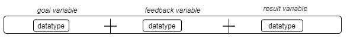<figcaption>Lightray simulation on the Table for 45° angle from the horizontal</figcaption>

In an Action Client-Server interaction, communication is ensured ROS Messages with three distinct roles: the goal, the feedback and the result . An action is executed when the goal requests an action with a set of parameters to the server. Feedback parameters can selected for monitoring during the action’s execution. The result informs any concurrent threads of the final state of the action.

<figcaption>Lightray simulation for Intersection of any 2 lightrays.</figcaption>

<h4 id="server-handling-of-actions">3 | Server Handling of Actions</h4>

The Action Server executes an action in the form of a callback functions. A task completes when a particular condition is met. In order to manage this, an action callback can incorporate a condition in its execution. The next section examines this in more depth.

Each of these pre-loaded behaviours needs to be scheduled. For this, an open-source Function Handler is used, referred to as the ROS Action Server .As a result, each function for a specific task server will be launched from a central <strong>launchfile</strong>:

html &lt;launch&gt; &lt;group&gt; &lt;remap from=’_goTo’ to=’drone1_goTo’/&gt; &lt;node name=’drone1’ pkg=’crazyswarm’ type=’ros_action_server.py’&gt; &lt;/node&gt; &lt;/group&gt;

&lt;group&gt; &lt;remap from=’_goTo’ to=’drone2_goTo’/&gt; &lt;node name=’drone2’ pkg=’crazyswarm’ type=’ros_action_server.py’&gt; &lt;/node&gt; &lt;/group&gt; &lt;/launch&gt;

This ROS launchfile loads the functions declared in the Action Server, and remaps them to each drone in the choreography. This allocates a thread under the form of a ROS node. These ROS nodes act as separate Request/Response instances.

<h4 id="parameter_handler">4 | ROS Parameter Handler</h4>

The ROS main thread includes a commonly-used component called the Parameter Server, implemented in the form of XMLRPC, and which is, as the name implies, a centralised database within which nodes can store data and, in so doing, share system-wide parameters.

python crazyflies: - channel: 35 id: 1 initialPosition: [0.0, 0.0, 0.0] type: default - channel: 27 id: 2 initialPosition: [1.0, 0.0, 0.0] type: default - channel: 27 id: 5 initialPosition: [4.0, 0.0, 0.0] type: default

Multiple programs query this file upon initialization of the swarm management layer. Each robot is distinguished by their channel, id and initialPosition. This allows for identifying drone ids and other unique information.

<figcaption>Lightray simulation for Intersection of any 2 lightrays.</figcaption>

<h4 id="scaling-to-multiple-drones">5 | Scaling to Multiple Drones</h4>

Similarly to , a procedural task-based programming approach is adopted. This can be likened to a centralized server that services multiple drones. Figure <a href="#fig:task_management_architecture" data-reference-type="ref" data-reference="fig:task_management_architecture">[fig:task_management_architecture]</a> shows the full Task Management Layer Architecture.

<figcaption>Results of Coverage Optimisation Study.</figcaption>

This approach values granularity, being lightweight, and the ability to share similar processes across multiple apps. As a result, it is therefore highly reusable for new tasks.

<h2 id="section:SPI">High Level Interface</h2>

A high level interface is an abstraction layer for development activities. In order to simplify task development, and align with the thesis goals, we develop a framework for high level interaction between the operator and the functionalities of the testbed.

<h3 id="motivation">Motivation</h3>

The Testbed, as described in Section. For such purposes, it is required to test user code. Therefore an interface is a key element for the user. There are several advantages to specialised tasks for the testbed.

<ul>
<li>
<strong>Handling sub-tasks</strong> to various levels of depth: microservices help automate sub-tasks at a desired complexity. When encapsulated in this way, are separate modules fit for demonstration, that can later be optimised and refined during development.
</li>
<li>
<strong>Monitoring the swarm</strong>: a central monitoring system can run in parallel with the particular algorithms that are tested and validated. For instance, a battery voltage threshold helps to monitor a correct running of the hardware.This allows for preventive maintenance during demonstrations but also during development.
</li>
</ul>

In summary, more ‘complex tasks’ will allow for the automation of separate subtasks in a controlled manner.

<h3 id="conceptual-overview">Conceptual Overview</h3>

The high-level interface combines three major elements:

<ul>
<li>
the management of low-level devices upon each robot,
</li>
<li>
communication with the swarm, and
</li>
<li>
scheduling of instructions.
</li>
</ul>

In order to achieve this, the intermediary structures for tasks are laid out here. Figure <a href="#fig:loop" data-reference-type="ref" data-reference="fig:loop">[fig:loop]</a> labels a hierarchy of tasks. The drone is instructed to alternate between two waypoints until a software condition is triggered.

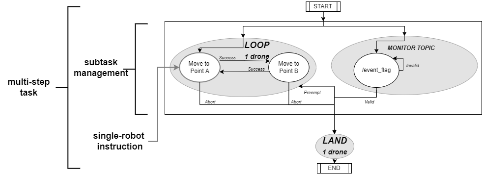<figcaption>Determining the intersection area of lightrays</figcaption>

This example serves to illustrate the conceptualisation of a subtask and a multi-step task. The concurrence of waypoints and the software trigger is consider a sub task, and within a state machine, which is referred to as a multi-step task. This framework offers a definition for complex tasks, as tasks that coordinate the scheduling of instructions, with multi-robot instructions.

<h3 id="architectural-approach">Architectural Approach</h3>

To create these complex tasks, this high level interface has the following architectural choices:

<ul>
<li>
<strong>Encapsulating robot instructions</strong> Robot commands are assimilated into this programming interface as individual tasks.
</li>
<li>
<strong>Encapsulating swarm instructions</strong> Robot instructions are included in generic functions as swarm instructions.
</li>
<li>
<strong>Encapsulating sub tasks</strong> Scheduling processes such as a concurrence runs in a function encapsulating it.
</li>
</ul>

This architecture is written in Python, known for its ease of use and flexibility. In this way, multi-step tasks manage the swarm stack, from executing single-robot commands to ensuring the dynamic management of swarms.

<h4 id="robot-instructions">Robot instructions</h4>

<figcaption>Overview of the Crazyswarm Control Loop, as per the Crazyswarm official documentation (August 2021) </figcaption>

The Crazyswarm API from Section <a href="#section:swarm" data-reference-type="ref" data-reference="section:swarm">1.5.5</a> interfaces with low-level hardware for landing, takeoff and further behaviours that can be coded remotely. However, for the purpose of <strong>centralised task management</strong>, the execution of each instruction should be monitored accordingly.  offer ROS telemetry tools, such as battery monitoring and a reset utility. These can be used as conditions in the execution process. Ultimately, an additional layer of abstraction is required for multi-drone instructions.

<h4 id="multi-robot-instructions">Multi-robot instructions</h4>

<figcaption>View of the Flight Arena during the 2 Drone Hover experiment.</figcaption>

This section outlines the functions developed <strong>for group behaviours</strong>: concurrent takeoffs and landings, querying multiple drones for low battery level, etc. Fly-Octogon and Land-all are examples of multi-robot instructions.

This microservice model is a major component of optimizing swarm programming towards the multipurpose task model outlined in the objectives.

<h4 id="sub-task-management">Sub task management</h4>

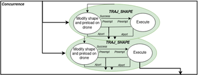<figcaption>Hover Experiment: Stability Tests on Flight Arena.</figcaption>

The objective for sub tasks is to assist in creating, and coordinating, <strong>higher-level behaviours</strong>. An example of this is the concurrent_traj module, whereas two drones are told to fly simultaneous trajectories. This is of particular interest as two drones will take <strong>indeterminate amounts of time</strong> to respond to commands. <strong>Concurrency</strong> — in the context of programming — is the ability for a program to be decomposed into parts that can run independently of each other.

<h4 id="multi-step-tasks">Multi-step tasks</h4>

A decision process combines the various modules developed above into a sequence of tasks. This is achieved with a Finite State Machine, which is implemented programmatically with the SMACH python library . A choreographic state machine is implemented in section <a href="#section:choreography" data-reference-type="ref" data-reference="section:choreography">1.7</a>.

<h2 id="section:choreography">Testbed Demonstration</h2>

A drone choreography is designed as a live demonstration of the Testbed’s functionality. The experiment data is accessible publicly .

<h3 id="choreography-design">Choreography Design</h3>

<figcaption>Hover Experiment: Stability Tests on Flight Arena.</figcaption>

The State Machine for the full choreography is available in Figure <a href="#diagram:fsm" data-reference-type="ref" data-reference="diagram:fsm">[diagram:fsm]</a>. This demonstration includes:

<ul>
<li>
Takeoff and landing, separately and concurrently.
</li>
<li>
A pre-loaded trajectory, from a Bezier curve: concurrently.
</li>
<li>
A polygonial shape flown by two drones, demonstrating simultaneous movement through a set of waypoints.
</li>
<li>
Autonomous state changes.
</li>
</ul>

This state machine functions any number of drones: using the swarm building blocks developed in Section <a href="#section:SPI" data-reference-type="ref" data-reference="section:SPI">1.6</a>, the dronesexecute trajectories simultaneously; it then moves to certain waypoints indefinitely. In this case a figure of 8 is executed on both drones followed by an octogon. Finally, upon an operator signal, the drones land. The state machine is such that the drones also land if one does not reach its corresponding waypoint in time.

<h4 id="pre-loaded-trajectory">1 | Pre-loaded Trajectory</h4>

<figcaption>3D Plot of 2 Drone Hover.</figcaption>

Two Figures of 8 are flown simultaneously. The figures of 8 are concurrent Bezier shapes, pre-loaded onboard each drone’s trajectory follower . This is coded using the high level interface as in Fig <a href="#code:exec_Fo8" data-reference-type="ref" data-reference="code:exec_Fo8">[code:exec_Fo8]</a>.

python fig8_sm = concurrent_trajs(selected_drones = ids, traj_id = 8) StateMachine.add(’FIG8_EXECUTE’, fig8_sm, transitions=’succeeded’ : ’NEXT_STATE’, ’aborted’ : ’land_all’, ’preempted’ : ’land_all’)

The Figure of 8 is assigned an id of 8. Other trajectories are assigned other ids. The concurrent_trajs function is thus called upon with the required drones and their required ids.

<h4 id="multi-point-trajectory.">2 | Multi-point Trajectory.</h4>

<figcaption>Stability Comparison of two Drones.</figcaption>

This state loads a custom trajectory on the drone, which is executed, before moving to an indefinite octogonal trajectory. The use of <strong>waypoint following</strong> is an automation of the motion to specific points.

<h4 id="topic-monitor">3 | Topic Monitor</h4>

<figcaption>Hover Experiment: Pitch, Yaw and Roll of the two drones.</figcaption>

The use of a <strong>Topic Monitor</strong> is useful to interface with active topics. For instance, at any one moment that a drone gets too close to a particular point, it initiates a landing. The intended behaviour is represented visually alongside.

This is another such subtask that fulfils the initial goal: monitoring the swarm with preventive measures during demonstration as well as training phases. This is performed programmatically with a concurrence between a drone and the /collision topic.

<h4 id="choreography-state-machine">4 | Choreography State Machine</h4>

The previous sections are integrated into a State Machine. The configuration of the state machine is displayed in Figure <a href="#fig:fsm" data-reference-type="ref" data-reference="fig:fsm">[fig:fsm]</a>. Individual tasks are coloured in green and swarm tasks in orange.

<figcaption>Network Interfaces Encapsulated in Operating Systems. </figcaption>

Three drones are positioned about the Flight Arena as in Figure <a href="#fig:chore_initialisation" data-reference-type="ref" data-reference="fig:chore_initialisation">[fig:chore_initialisation]</a>.

<h4 id="choreography-execution">5 | Choreography Execution</h4>

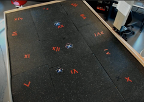<figcaption>Network interfaces with ROS.</figcaption>

The state machine is run on a separate thread as in Figure <a href="#code:exec_choreography" data-reference-type="ref" data-reference="code:exec_choreography">[code:exec_choreography]</a>.

    myswarm = swarmInterface(all_ids = [1,3,5])
    sm0 = myswarm.execTrajandOctogon (ids = [1,3], traj_shape = 8)
    myswarm.start_sm_on_thread(sm0)

This invocation of the state machine clearly shows drone ids [1,3,5] as extracted from the Parameter Server, in order to act as the drones 1,2,3. The trajectory shape 8 refers to the Figure of 8.

<h3 id="results-1">Results</h3>

We proceed with an inspection of the demonstration. The flightpaths of all three drones are plotted together.

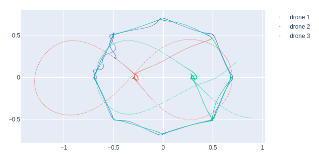<figcaption>Swarm solution interactions with System Architecture</figcaption>

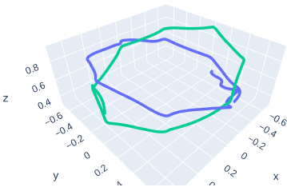<figcaption>Crazyswarm within the Network Implementation.</figcaption>

Overall, the flightpaths are smooth. The Figures of 8 are traced distinctly, as well as the two octogons. The figure of 8 of drone 3 is discontinuous, and yet there is no apparent effect on the shape. This suggests that the drone moved beyond the area localized by motion capture. When examining the octogons, the top view shows a near perfect superposition: showing small differences in position of less than 2cm. Finally, a line connects the two shapes. This shows that these figures did actually occur in sequence.

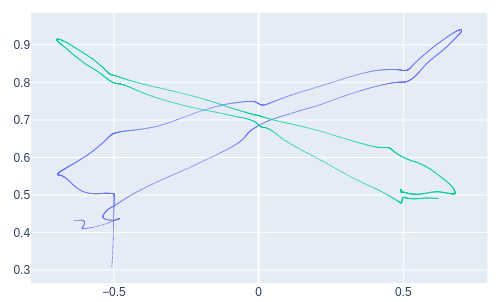 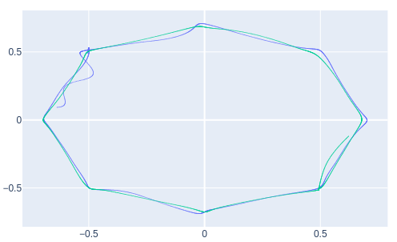

Further inspection of the octogons requires a topview and a sideview. The Octogon is traced very clearly. Near the end of the experiment, there is a noticeable wobble in the blue line. This behaviour is due to a low battery level. A notable difference is the wobble in the xz plane, which demonstrates a loss of precision as the drones get closer to the ground. There is a symmetrical behaviour. Further tests can determine what this is attributed to.

<table>
<thead>
<tr class="header">
<th style="text-align: left;">Test Description</th>
<th style="text-align: center;">Value</th>
<th style="text-align: center;"></th>
<th style="text-align: left;"></th>
</tr>
</thead>
<tbody>
<tr class="odd">
<td style="text-align: left;">Volume of Flight Arena Localized by Motion Capture</td>
<td style="text-align: center;"></td>
<td style="text-align: center;"></td>
<td style="text-align: left;"></td>
</tr>
<tr class="even">
<td style="text-align: left;">Maximum Flight Error Recorded in Hover Test</td>
<td style="text-align: center;"></td>
<td style="text-align: center;"></td>
<td style="text-align: left;"></td>
</tr>
</tbody>
</table>

<h3 id="discussion">Discussion</h3>

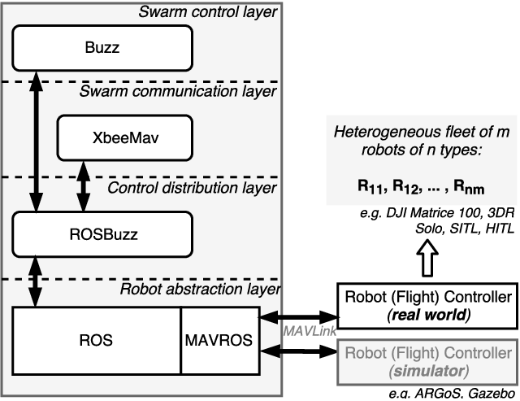<figcaption>Simulation environment interactions with System Architecture</figcaption>

In this chapter, a swarm programming approach is developed along similar lines to , the swarm API that was developed for swarms of nanodrones. Both frameworks load a set of functions, they allow the user to select which drones perform a certain task, and group drones according to the task at hand. While Buzz manages membership with a dedicated hash table, our interface makes use of a global parameter handler . Both architecture allows for the development different modules can be developed independently and related dynamically.

With a high-level interface, this work concerns itself with a swarm-specific language that is not "too top-down" or "too bottom-up". This distinction is seen with increasing swarm sizes, and for creating user tasks more focused on development, or on improving safety and phone interference for demonstrations.

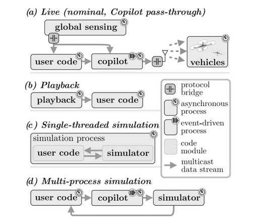<figcaption>Task Manager interactions with System Architecture</figcaption>

Figure <a href="#diagram:swarm_stack" data-reference-type="ref" data-reference="diagram:swarm_stack">[diagram:swarm_stack]</a> demonstrates that Buzz uses comparable structures for swarm engineering.). ROS communicates with device hardware via MAVROS, a ROS library for compatible Micro Aerial Vehicules. It then has a control distribution layer that is comparable to our Task Manager, a swarm communication layer like Crazyswarm and a swarm control layer like our high level interface. The swarm stack in other research may be composed of other technologies, but retains this structure.

The Flying Machine Arena  is an active area of research for drone development and demonstration, and their ’Copilot’ is described as a flight monitoring solution. Figure <a href="#diagram:copilot" data-reference-type="ref" data-reference="diagram:copilot">[diagram:copilot]</a> demonstrates the types of activities achieved via the copilot: updating drone poses during code execution (a), executing playback on recorded poses (b), and executing procedures in simulation (c). These elements are handled by the Task Manager described in this chapter, demonstrating the pertinence of a flight management solution.

The procedural task-based approach of this chapter is not unique: it figures in  who develops a generic pythonic form that need not depend on middleware for task management. All in all, this approach can aid in development, in ways that can be outlined here.

<ul>
<li>
preventing mechanical failure upon software failure.
</li>
<li>
assist in creating, and coordinating, higher-level behaviours.
</li>
<li>
monitor the state of every UAV asynchronously.
</li>
<li>
Assist in troubleshooting with a modular layout.
</li>
</ul>
<h3 id="summary">Summary</h3>

This flight has demonstrated multiple working functionalities. The first is the use of the Swarm Programming Interface. Using the building blocks developed in this chapter, it is possible to develop a multi-stage process, one that includes preloaded trajectories as well as waypoint trajectories, choreographic positioning, and escape cases upon a system abort. With such tools for assistance during development, this set of functionalities pushes beyond previous work, as it offers a layer beyond the crazyswarm’s robot instruction set.

<h2 id="chapter-summary">Chapter Summary</h2>

The proposed state-based architecture is a first step towards creating UAV operations to perform complex tasks, collaboratively or otherwise. After all, this framework has put in place the monitoring tools and the task-based framework to execute complex behaviours; and beyond that, putting in place a Flight Arena has already helped to validated these tools. Such services can easily be tested and deployed from a framework like this one.

Certain elements in this framework are taken a step further in Chapter <a href="#c2" data-reference-type="ref" data-reference="c2">[c2]</a>: the ability to send streaming setpoints to a drone opens the possibility of flight piloting through other means. This would not be possible without the foundation established in this chapter: the drone architecture, the motion capture setup and the swarm framework.

The tools that were established here may need to be challenged by further research. One direction is the decentralisation of agents with respect to the platform: where this framework has a central role in allocating behaviours, one would opt for a framework that gives each agent the ability to act independently. However, the central monitoring can remain a major asset when developing such a swarm, as it serves as a safety recourse to prevent any hardware damage.

The testbed makes great use of distributed networking, and it aligns with the first approach of the thesis for task creation. From handling specific parameters, to managing the task execution and scheduling in a centralised manner, the middleware monitors the different agents in an asynchronous manner. As opposed to non-distributed systems, such as direct one-to-one links to onboard devices, it allows the developer to divert their focus from system communication to performance-critical applications.
data-cites="


